  <picture>
    <source media="(max-width: 700px)" srcset="card/terminal-narrow.svg">
    
  </picture>

  <picture>
    <source media="(prefers-color-scheme: dark)" srcset="https://raw.githubusercontent.com/solid174/solid174/output/snake-mocha.svg">
    
  </picture>

